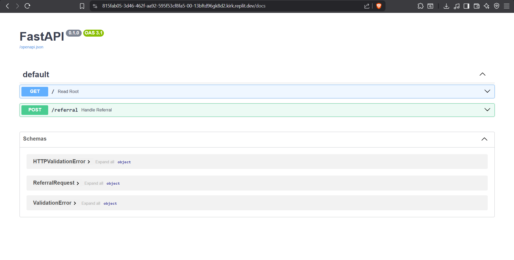
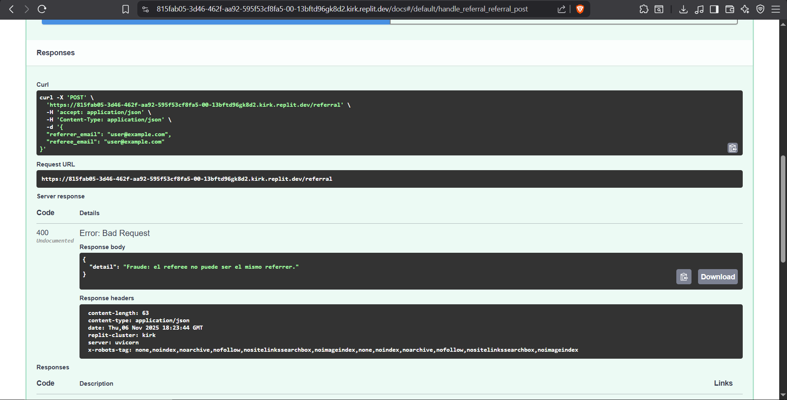
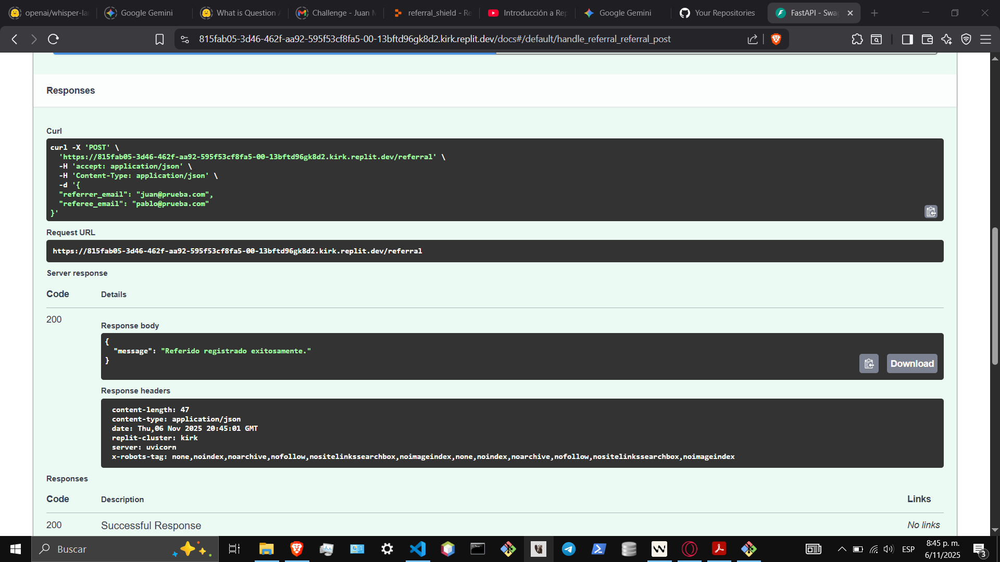
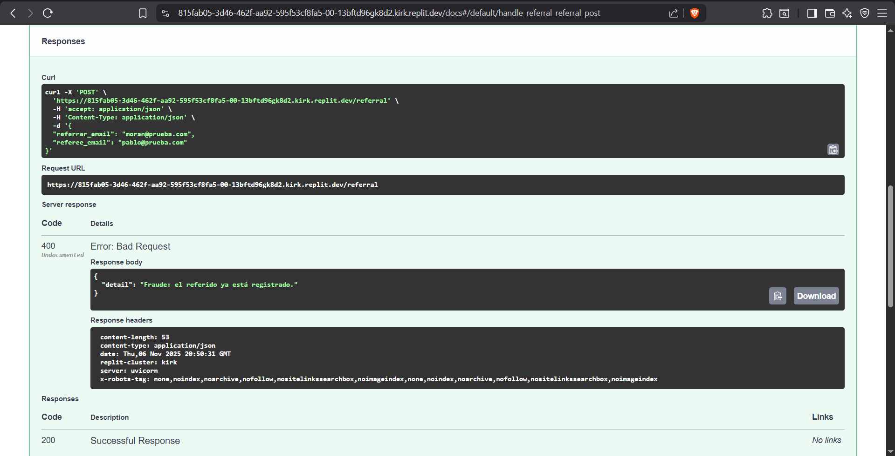

# API de Referrals

Esta API permite gestionar un sistema de referidos con validaciones básicas antifraude. Está construida con FastAPI y utiliza un archivo CSV (`referrals.csv`) como base de datos simulada para almacenar los referidos.

## Endpoints

### 1. Root Endpoint (`GET /`)

Este endpoint es un punto de entrada simple para verificar que la API está funcionando correctamente.

- **URL:** `/`
- **Método:** `GET`
- **Respuesta Exitosa:**
  ```json
  {
    "message": "API de Referrals funcionando correctamente."
  }
  ```

### 2. Endpoint de Referidos (`POST /referral`)

Este endpoint maneja el registro de nuevos referidos, aplicando varias validaciones antes de almacenar la información y simular el envío de correos electrónicos.

- **URL:** `/referral`
- **Método:** `POST`
- **Cuerpo de la Solicitud (Request Body):**
  Se espera un objeto JSON con los siguientes campos:
  ```json
  {
    "referrer_email": "correo_del_referidor@example.com",
    "referee_email": "correo_del_referido@example.com"
  }
  ```
  - `referrer_email`: El correo electrónico de la persona que refiere.
  - `referee_email`: El correo electrónico de la persona referida.

- **Validaciones y Lógica de Negocio:**
  1. **Normalización de Emails:** Ambos correos son normalizados (se eliminan alias `+` y puntos en Gmail) para evitar fraudes.
  2. **Referrer y Referee Diferentes:** Se verifica que el `referrer_email` y el `referee_email` no sean el mismo.
  3. **Límite de Referrals:** Un referidor no puede exceder un máximo de 10 referencias.
  4. **Patrón de Email del Referido:** Se realizan chequeos simples para detectar correos sospechosos (ej. `test@`, `fake@`, `mailinator`).
  5. **Existencia del Referido:** Se verifica que el `referee_email` no esté ya registrado en el sistema.

- **Acciones:**
  - Si todas las validaciones son exitosas, el referido se registra en el archivo `referrals.csv`.
  - Se retorna un mensaje de confirmacion al `referee_email`.
  - Se retorna un mensaje de agradecimiento al `referrer_email`.

- **Respuestas:**
  - **Éxito (200 OK):**
    ```json
    {
      "message": "Referido registrado exitosamente."
    }
    ```
  - **Errores (400 Bad Request):**
    - `Fraude: el referee no puede ser el mismo referrer.`
    - `Fraude: el referidor ha excedido el límite de 10 referencias.`
    - `Fraude: el email del referido parece inválido o sospechoso.`
    - `Fraude: el referido ya está registrado.`

## Screenshots

| Codigo400.png | Codigo200.png | Codigo200.png |
|-------------|----------|---------|
|  |  |  |

| Codigo200.png | Codigo200.png |
|--------------|---------|
|  |  |